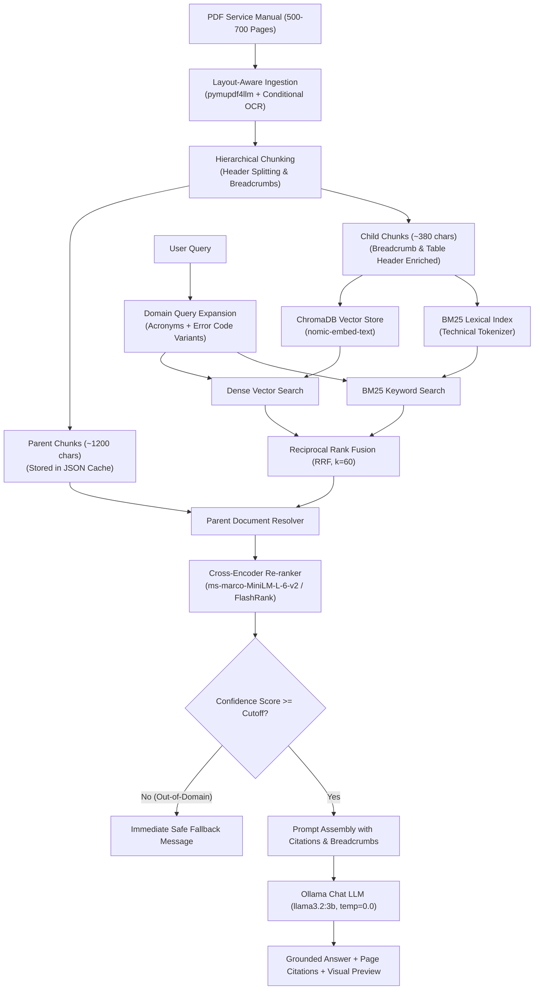

# Medical Equipment Manual RAG System

A production-grade, memory-efficient local **Retrieval-Augmented Generation (RAG)** application engineered for medical equipment field engineers and biomedical technicians. Ingest dense 500–700+ page technical service manuals, schematics, and pinout guides to query them with natural language — delivering strictly grounded answers with exact section breadcrumbs, page citations, and high-resolution visual page previews.

---

## 🌟 Key Architecture & Features

### 1. 📑 Layout-Aware Ingestion & Zero-Data-Loss
- **Markdown Extraction (`pymupdf4llm`)**: Preserves document structure including Markdown headers (`#`, `##`, `###`), nested lists, and formatted Markdown tables (`| ... |`).
- **Streaming Page-by-Page**: Yields documents per page to prevent memory spikes on massive manuals.
- **Conditional OCR Fallback (`pytesseract`)**: Automatically identifies scanned/image-heavy pages with sparse digital text and runs Tesseract OCR to ensure zero schematic or error table data loss.
- **Visual PDF Page Previews (`PyMuPDF`)**: On-demand high-resolution rendering of cited manual pages and wiring schematics directly inside the UI.

### 2. 🧩 Hierarchical Parent-Child Chunking & Breadcrumbs
- **Header-Aware Splitting**: Parses structural headers to identify document hierarchy.
- **Dynamic Breadcrumbs**: Injects contextual breadcrumbs (e.g., `[Doc: STORZ_Manual.pdf > Section 3: Troubleshooting > E-205 Error Codes | Page: 42]`) into chunk text for enhanced vector and lexical recall.
- **Table Integrity**: Retains Markdown tables as atomic units and automatically replicates column header rows across child chunks.
- **Parent-Child Windows**:
  - **Parent Chunks (~1200 chars)**: Full logical sections and complete tables supplied to LLM context.
  - **Child Chunks (~380 chars)**: High-precision semantic units indexed for dense and sparse search.

### 3. 🩺 Domain Adaptation & Query Expansion
- **Medical & Hardware Acronym Expansion**: Automatically expands common technical terms (e.g., `PSU` $\rightarrow$ `power supply unit`, `OVP` $\rightarrow$ `overvoltage protection`, `CCU` $\rightarrow$ `camera control unit`, `NIBP`, `SDI`, `DSP`, `FPGA`, `EMC`, `ESD`).
- **Multi-Format Error Code Normalization**: Detects patterns like `E205`, `E-205`, `ERR_205`, `Error 205`, or `0x8004` and generates search variants to maximize retrieval recall.

### 4. ⚡ Hybrid Search, RRF & Cross-Encoder Re-Ranking
- **Dense Retrieval**: Semantic vector search via ChromaDB using Ollama embeddings (`nomic-embed-text`).
- **Sparse Retrieval (BM25)**: Lexical keyword search with a custom technical tokenizer preserving error codes, part numbers (`LAMP-9812A`), and electrical ratings (`110-240V`, `50/60Hz`).
- **Reciprocal Rank Fusion (RRF, $k=60$)**: Merges dense and sparse rankings without score scale bias.
- **Parent Document Resolution**: Maps winning child search hits back to their overarching parent context window.
- **Cross-Encoder Re-ranking (`ms-marco-MiniLM-L-6-v2` / `FlashRank`)**: Scores query-document pairs using cross-attention to filter irrelevant passages.
- **Confidence Gate & Graceful Fallback**: Enforces a confidence score cutoff to prevent hallucinations; out-of-domain queries immediately return a safe fallback message without wasting LLM compute.

### 5. 🔒 100% Offline & Private
- Runs completely locally via **Ollama** (`nomic-embed-text` and `llama3.2:3b`) — zero external API keys or cloud data transmission required.

---

## 🏗️ System Architecture Pipeline



---

## 📋 Prerequisites

| Requirement | Specification |
|---|---|
| **Python** | 3.10 or higher |
| **Ollama** | Installed and running ([https://ollama.com](https://ollama.com)) |
| **Tesseract OCR** *(Optional)* | For scanned/image-only PDF pages ([Tesseract OCR](https://github.com/tesseract-ocr/tesseract)) |

### Pull Required Ollama Models

Ensure the Ollama server is running, then pull the embedding and chat models:

```bash
ollama pull nomic-embed-text
ollama pull llama3.2:3b
```

---

## 🚀 Quick Start

### 1. Clone or Navigate to the Workspace

```bash
cd medical_rag_mvp
```

### 2. Create and Activate a Virtual Environment

```bash
# Windows
python -m venv venv
venv\Scripts\activate

# macOS / Linux
python3 -m venv venv
source venv/bin/activate
```

### 3. Install Dependencies

```bash
pip install -r requirements.txt
```

### 4. Place Manuals (Optional)

Copy PDF technical manuals into the `data/manuals/` directory, or upload them directly via the web UI.

### 5. Launch the Streamlit Web Application

```bash
streamlit run app.py
```

The web interface will be accessible at `http://localhost:8501`.

---

## 🖥️ Streamlit Web Interface Features

- **📂 Manual Manager**: Upload new manuals or switch between active PDFs.
- **⚙️ Real-time Pipeline Controls**:
  - **Context Parent Windows (Top-K)**: Adjust the number of parent context windows passed to the LLM (1–8).
  - **Confidence Score Cutoff**: Adjust the Cross-Encoder score threshold (-8.0 to +2.0).
  - **Visual Page Previews**: Toggle rendering of original PDF pages next to citations.
  - **Diagnostics & Telemetry**: Toggle real-time inspection of retrieval scores.
- **💡 Answer Card & Citations**: Clear grounded response with source file, page number, and section hierarchy.
- **🖼️ High-Resolution Page Previews**: Displays diagrams, pinout charts, and schematics directly from the cited page numbers.
- **🔬 Multi-Tab Diagnostics Inspector**:
  - **🔤 Query Expansion**: View expanded medical acronyms and error code variants.
  - **🎯 Final Re-ranked Context**: Review top parent windows and Cross-Encoder logit scores.
  - **⚡ BM25 Lexical Hits**: Inspect exact keyword match rankings.
  - **🌐 Dense Vector Hits**: Inspect Chroma cosine distance scores.
  - **📊 Fused Telemetry**: View candidate metrics and gate decisions.

---

## 🛠️ CLI Diagnostics & Testing

### Run Retrieval Debugger

Inspect retrieval stages, fusion metrics, cross-encoder scores, and LLM output via the CLI:

```bash
# Debug with the first available manual in data/manuals/
python debug_retrieval.py --query "What causes error code E-205?"

# Debug a specific manual without invoking the LLM
python debug_retrieval.py --manual "STORZ_Manual.pdf" --query "Fuse specifications" --no-llm
```

### Run Unit & Integration Test Suites

```bash
# Run pipeline and domain enhancement tests
python -m unittest test_pipeline.py test_enhancements.py
```

---

## 📁 Project Structure

```text
medical_rag_mvp/
├── data/
│   └── manuals/               # PDF technical & service manuals (500–700 pages)
├── chroma_db/                 # Persistent Chroma vector stores & parent document caches
├── src/
│   ├── __init__.py            # Package initializer
│   ├── pdf_loader.py          # Layout-aware streaming PDF loader, OCR fallback & page image renderer
│   ├── chunking.py            # Header-aware splitting, breadcrumbs, table preservation & parent-child chunking
│   ├── query_expansion.py     # Medical acronym dictionary & error code variant generator
│   ├── vector_store.py        # ChromaDB indexer, disk cache manager & pipeline builder
│   ├── hybrid_retriever.py    # BM25 + Dense hybrid retriever, RRF, Cross-Encoder reranker & diagnostics
│   └── rag_chain.py           # Strictly grounded QA prompt chain & confidence fallback gate
├── app.py                     # Modern Streamlit web interface with diagnostics and visual previews
├── debug_retrieval.py         # CLI diagnostic and verification tool
├── test_pipeline.py           # Unit tests for chunking, breadcrumbs, tokenizer & hybrid retrieval
├── test_enhancements.py       # Unit tests for query expansion, acronyms & confidence gating
├── requirements.txt           # Project dependencies
└── README.md                  # Project documentation
```

---

## ⚙️ Key Configuration Parameters

| Parameter | Location | Default | Description |
|---|---|---|---|
| `DEFAULT_PARENT_CHUNK_SIZE` | `src/chunking.py` | `1200` chars | Target size for parent context windows sent to LLM |
| `DEFAULT_CHILD_CHUNK_SIZE` | `src/chunking.py` | `380` chars | Target size for searchable child chunks |
| `DEFAULT_CONFIDENCE_THRESHOLD` | `src/hybrid_retriever.py` | `-4.5` | Cross-encoder logit threshold for accepting retrieved context |
| `LOW_TEXT_THRESHOLD` | `src/pdf_loader.py` | `50` chars | Minimum character count before triggering conditional OCR |
| `OCR_DPI` | `src/pdf_loader.py` | `300` DPI | Image rendering resolution for Tesseract OCR |
| `rrf_k` | `src/hybrid_retriever.py` | `60` | Constant factor for Reciprocal Rank Fusion |
| `model_name` (Chat) | `src/rag_chain.py` | `llama3.2:3b` | Local Ollama model for question answering |
| `model_name` (Embeddings) | `src/vector_store.py` | `nomic-embed-text`| Local Ollama model for vector embeddings |

---

## 🛡️ Strict Grounding & Safety Rules

1. **Zero Hallucination**: The LLM is constrained by system prompts to answer strictly from the provided context. If information is absent, it responds with: `"Information not available in the provided manual."`
2. **Exact Citations**: Every answer provides the source document, page number, and section path.
3. **No Improvised Procedures**: Never fabricates safety steps or unverified maintenance procedures.
4. **Preserved Tables**: Electrical specifications, pinout tables, and torque ratings are reproduced directly from the source tables.
